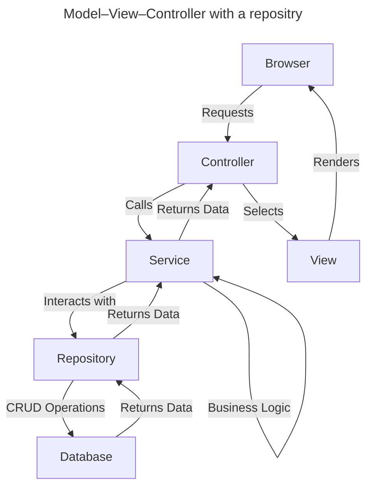
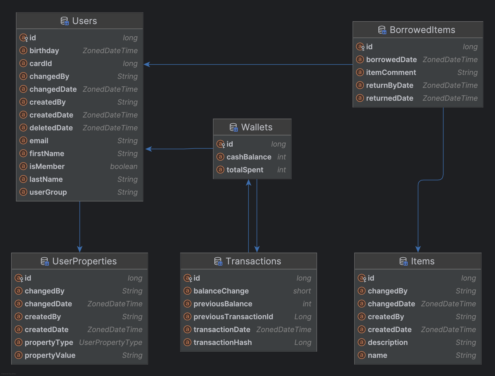

# Developer information

Deltabeer is written in mainly [Kotlin](https://kotlinlang.org/) using [Gradle](https://gradle.org/) as a build tool and
leveraging the [Spring Boot](https://spring.io/projects/spring-boot) framework.
[Hibernate](https://hibernate.org/) is used for persistence.

## Model

This program follows the Repository [MVC pattern](https://en.wikipedia.org/wiki/Model%E2%80%93view%E2%80%93controller)
(Model–View–Controller) with [DTO](https://en.wikipedia.org/wiki/Data_transfer_object)s for transferring data through
a [REST](https://en.wikipedia.org/wiki/REST)
-like [JSON](https://en.wikipedia.org/wiki/JSON) [API](https://en.wikipedia.org/wiki/API),
and [DAO](https://en.wikipedia.org/wiki/Data_access_object)s for accessing and interacting with the database.
A third object type without a postfix is used internally for business logic.

DTOs live in the View-layer, whereas DAOs live in the Repository-layer.
The Controller-layer is the interface between DTOs and internal objects which are used by Services in the Model-layer.
The Model-layer also translates between internal objects and DAOs that represents objects in the database.

Spring takes care of the Controller- and View-layers
using [Decorations](https://www.baeldung.com/spring-interface-driven-controllers) and Hibernate handles the Repository
layer, so we mostly have to care about the Model-layer.
This includes configuration and business login in the Service.

## Database

The database is modelled using Hibernate decorations (using `spring.jps.hibernate.ddl-auto: create` and
`spring.jps.show-sql: true`),
and then copied over to regular SQL creation queries to use with [Flyway](https://github.com/flyway/flyway) for better
control over the database.

Normally `hibernate.ddl-auto` is set to `validate`,
so remember to update the Flyway migrations when changing the database using Hibernate.

The main database table is the _Users_ table which — as the name indicates, contains the users registered in the system.
Each user is given a unique ID which is not exposed.
Users are retrieved using either the cardID or e-mail field which must both be unique to each user.
This opens up for the possibility of changing a user's cardID using e-mail or updating the e-mail using the cardID.

A wallet is created when a user first performs a transactions, each user can only have one wallet.
This wallet is stored in the aptly named _Wallets table.
Each wallet transaction (i.e. buying or spending tokens) is stored in the _Transactions_ table for auditing purposes.
It should be possible to re-build and verify a Wallet balance using the transaction log for auditing purposes.

For personalisation and fun, it's possible to register different _properties_ on a user,
these properties are defined in
the [UserPropertyType](../src/main/kotlin/dev/stonegarden/deltahouse/user/UserPropertyType.kt) enum as
either `TITLE`, `COMMENT`, `CREDIT` or `OTHER`.
The `CREDIT` property is used to give users the possibility of having a negative wallet balance.

A planned feature is the use of this system to register items and keeping track of borrowed items by user,
though this can probably be scrapped if there's no need for the feature.
This could perhaps be split into a different application.

## Profiles

When running locally the `local-h2` can be used to spin up an in-memory [H2-database](https://www.h2database.com/).
This profile is also set up to run the migrations present in the `db/testdata` resources folder,
i.e. populate the database with testdata.

There is also a `local-postgres` profile for connecting with a local [PostgreSQL](https://www.postgresql.org/) database.

## Testing

[JUnit 5](https://junit.org/junit5/) is used for testing.
Developers should aim to write simple [unit tests](https://en.wikipedia.org/wiki/Unit_testing) for each new feature or
fix they create.
This is to avoid regressions and maintain a stable codebase.

## Development

Developers should aim to use [Conventional Commits](https://www.conventionalcommits.org/en/v1.0.0/) for concise commit
comments explaining what they've changed.

It would also be good to introduce a Changelog following [Keep A Changelog](https://keepachangelog.com/en/1.1.0/)
practises,
and follow [Semantic Versioning](https://semver.org/).
